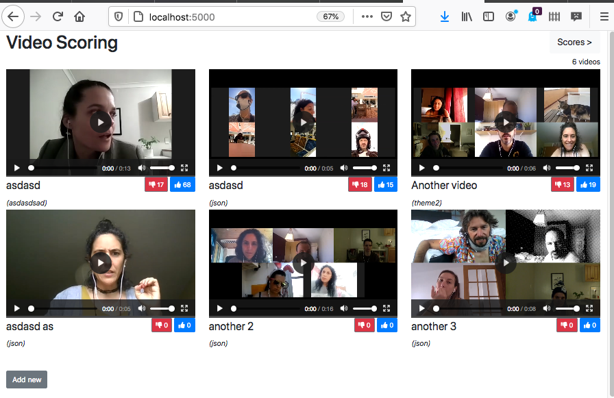
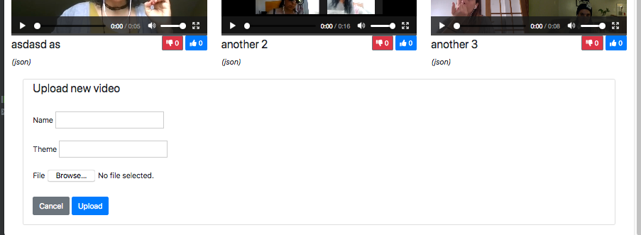
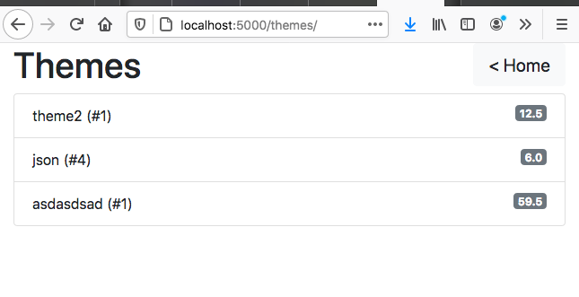

# video-themes

Demo of a video library using mongoDB GridFS storage. 

User can:

 1. upload a video
 
 2. issue a *thumbs up* or a *thumbs down* 






Scores page shows the aggregations of videos by *thmes*, the number of videos in each theme and the score accoring to the rule:
    
    thumbs_up - (thumbs_dn / 2)



# Setup

 1. Clone the repository and move into the directory that it created:
```
$ git clone https://github.com/rmendocna/video-themes.git
$ cd video-themes
```
    
 2a. Start a virtual environment, install requirements and start gunicorn server. 
    For this option you must have a MongoDB server running already.
```    
video-themes$ python3 -m venv .
video-themes$ source bin/activate
(video-themes) video-themes$ pip install -r requirements.txt
(video-themes) video-themes$ gunicorn project.wsgi
```
    
    Finally, point your browser to ``http://localhost:8000/``
    
 2b. Alternatively, if you a have docker installed, just run
``` 
video-themes$ docker-compose up
```
   The container starts a MongoDB and a Nginx server on port 80.
   
   You can then browse to ``http://localhost/`` and have your data persist
   across multiple runs of the containers 

## Testing

 Having followed setup option `2a.` you can run tests locally by doing
```
(video-themes) video-themes$ pytest project
```
